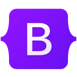
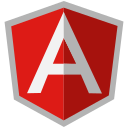
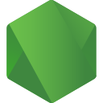
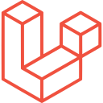
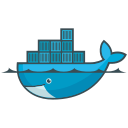
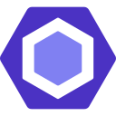
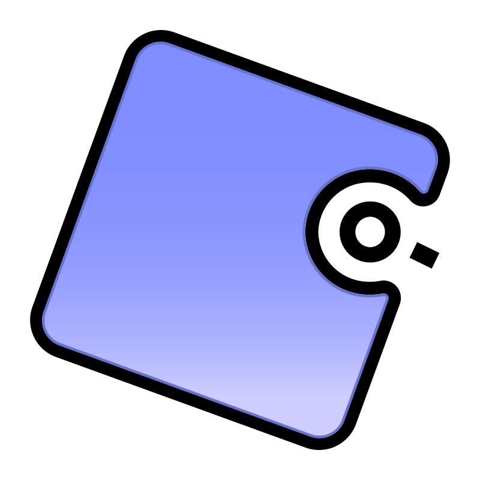
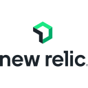
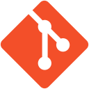
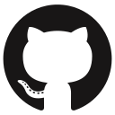

## Filipe Golfe

I'm a full-stack web developer with strong experience in high-throughput ERP systems, commercial automation, and electronic invoicing solutions. Experienced in working both independently and within large teams, with a focus on delivering performant, scalable, and maintainable systems using DDD, microservices, clean code, design patterns, automated tests and related best practices.

<picture>
  <source
    media="(prefers-color-scheme: dark)"
    srcset="https://github-readme-stats-tau-eight-22.vercel.app/api?username=filipe-golfe&theme=dark&show_icons=true&hide=stars&show=reviews&rank_icon=github"
  />
  
</picture>

- 🎓 Bachelor’s degree in Software Engineering from Universidade do Contestado (UNC)
- 🏢 Currently working at Zucchetti
- 💻 Professionally coding since 2022
- 🌍 Languages: English/Portuguese (Brazil)
- 🎂 Date of birth: 1 November 2002

## 🚀 Technologies

    
  ### Programming Languages
  

    
    
    
    
    
  

  ### Frontend
  

    
    
    
    
    
    
    
  

  ### Frameworks & Libs
  

    
    
    
    
    
    
  

  ### Databases & ORMs
  

    
    
    
    
    
    
  

  ### DevOps
  

    
    
    
    
  

  ### Tests & Quality Code
  

    
    
    
    
    
  

  ### Package Managers
  

    
    
    
    
  

  ### Messaging & Observability
  

    
    
    
  

  ### Operational Systems
  

    
    
  

  ### Developer Tools
  

    
    
    
    
    
  

  ### Management & Documentation
  

    
    
  

## 🧩 Contributions

<picture>
  <source media="(prefers-color-scheme: dark)" srcset="https://raw.githubusercontent.com/filipe-golfe/filipe-golfe/output/github-contribution-grid-snake-dark.svg">
  <source media="(prefers-color-scheme: light)" srcset="https://raw.githubusercontent.com/filipe-golfe/filipe-golfe/output/github-contribution-grid-snake.svg">
  
</picture>

## ☎️ Contact

  
  
  
   

